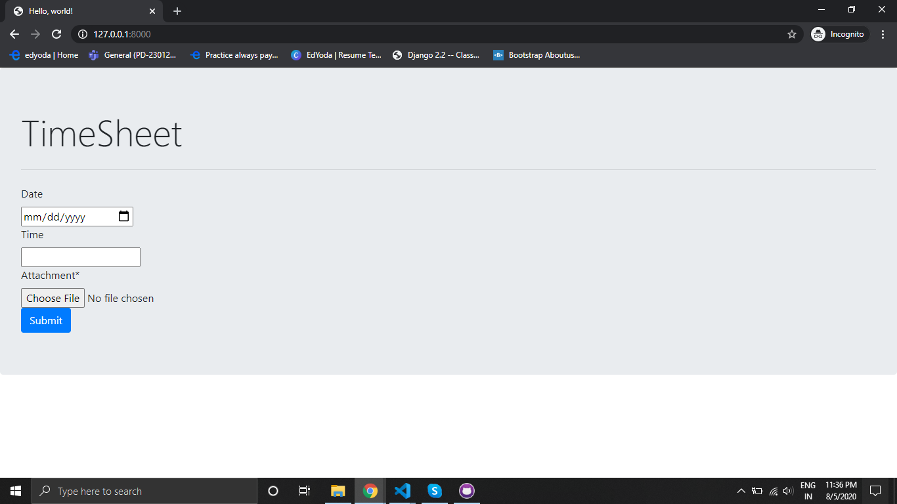
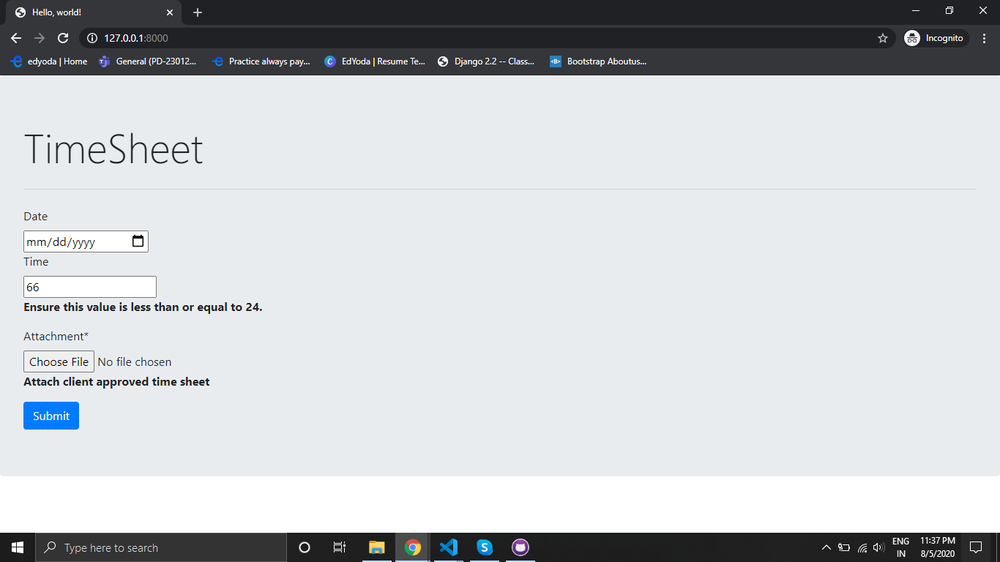

# TimeSheet

A) Requirements:
 - Django 2.2.12
 - Python 3.8
 
B) Posted the actual code in this repository. To work this on system, need to install the virtual environment and then put the "timesheet" folder insite the envionment.
you can find the Steps for installing virtual environment and startig the project in the url: https://help.dreamhost.com/hc/en-us/articles/215317948-How-to-install-Django-using-virtualenv

C) Images of the timesheet form:
 1. Form without error messages and validation

 2. 1. Form with error messages and validation

 
